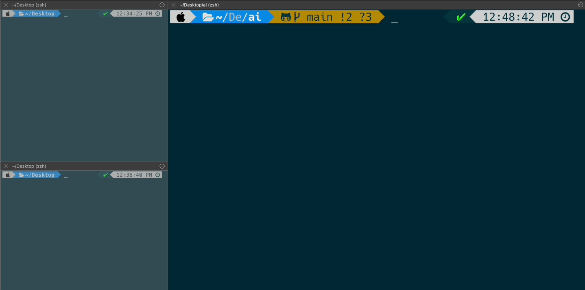

# ChatGPT4Terminal
Integrating ChatGPT into Terminal ©Mr.Dev

## Config
1. Clone source to `path-to-your-folder`

2. copy .env.example to .env and setup your OpenAI API Key 
   
   `OPENAI_API_KEY=your-openai-api-key`
3. Install python libs
   
   `pip install -r requirements.txt`
4. adding this line to .zshrc
   
    `alias '?'="python3 {path-to-your-folder}/main.py"`

## Usage
1. on your Terminal, type `?` to show promt
2. type what you want
3. type `c` then `Enter`  for clearing current context
4. type `x` then `Enter` for exiting

## Screenshot

